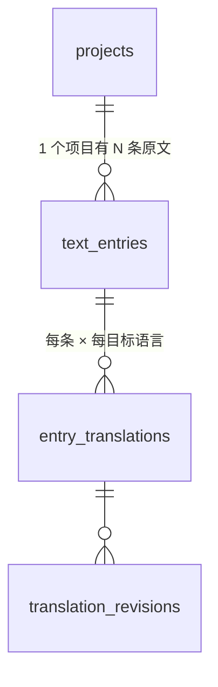

# ER 图(MVP)

> 状态:草稿,Mark 绘制中。范围:只画 MVP 的 11 个 UC 用到的表。

## 实体清单

profiles / projects / project_members / text_entries / entry_translations /
translation_revisions / entry_sets / entry_set_items / tasks / glossary_terms

## 图

## 画图时必须回答的五个问题

- [ ] 1. 审核决定存哪:revision 上加列,还是独立 review_decisions 表?
      (先想清楚:打回后重交,产生的是新 revision 还是复用旧的?)
- [ ] 2. entry_translations.current_revision_id 与 revisions.translation_id
      的循环外键怎么处理?
- [ ] 3. file/section 独立成表还是先用 text_entries 上的列?
- [ ] 4. dup(重复句)机制:彻底砍掉,还是留 dup_key 列预留?
      (结论要回写进 use case 文档的决策一节)
- [ ] 5. 每张表都冗余 project_id 吗?(RLS policy 的实用主义 vs 范式)
