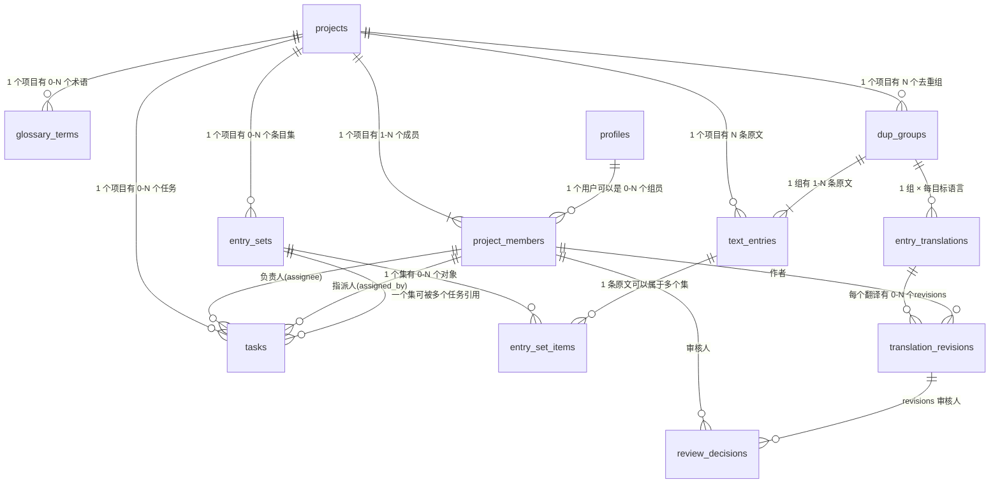

# ER 图(MVP)

> 状态:草稿,Mark 绘制中。范围:只画 MVP 的 11 个 UC 用到的表。

## 实体清单

profiles / projects / project_members / text_entries / dup_groups / entry_translations /
translation_revisions / entry_sets / entry_set_items / tasks / glossary_terms / review_decisions
(共 12 张)

## 图

## 画图时必须回答的五个问题

- [x] 1. 审核决定存哪:revision 上加列,还是独立 review_decisions 表?
      (先想清楚:打回后重交,产生的是新 revision 还是复用旧的?) 新的
- [x] 2. entry_translations.current_revision_id 与 revisions.translation_id
      的循环外键怎么处理? 保留 current_revision_id,设为可空,只由审核通过的那个 RPC 更新。
- [x] 3. file/section 独立成表还是先用 text_entries 上的列? 同意,MVP 不做文件级操作,用列足够
- [x] 4. dup(重复句)机制:彻底砍掉,还是留 dup_key 列预留?
      (结论要回写进 use case 文档的决策一节) 保留且落地为 dup_groups 表,entry_translations 挂在组上而非单条原文上
- [x] 5. 每张表都冗余 project_id 吗?(RLS policy 的实用主义 vs 范式)实用主义
